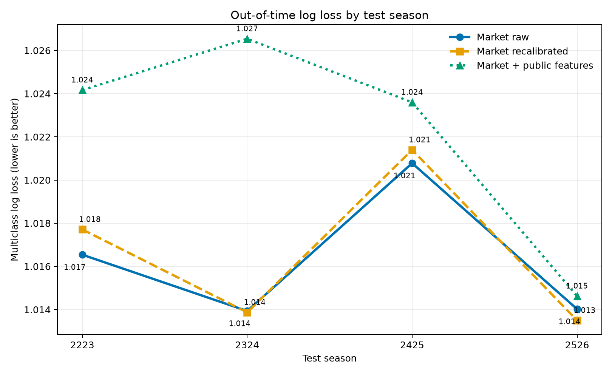
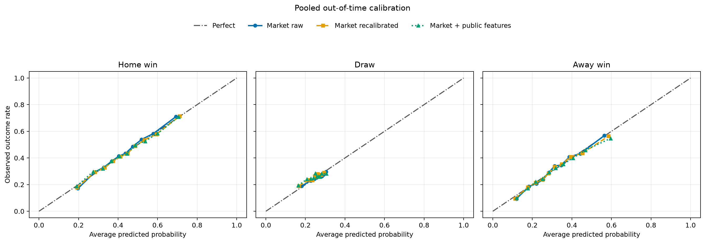

# When Should We Trust Market Probabilities?

## A temporal audit of third-party football forecasts

This project independently audits English football market probabilities rather
than trying to outbuild a professional sports-data company. It asks whether
normalized market-average closing probabilities should be used as-is,
recalibrated, or augmented with simple public pre-match information.

> **Build-vs-buy decision: use the market probabilities as-is.**

Across four expanding-window test seasons, recalibration does not produce a
robust improvement. Adding Elo, recent form, rest, league, and season progress
worsens log loss in all four test seasons. The result is a model-risk and vendor
evaluation finding, not a betting strategy.

## Why this project matters

Organizations often buy external scores, forecasts, and AI services. They still
need to determine whether those outputs are calibrated, stable across time and
groups, and worth supplementing with internal data. This repository demonstrates
that evaluation workflow with football probabilities as a public, reproducible
case.

The project complements a model-building portfolio: it focuses on when not to
build, how to validate a third-party probability, and how to report a negative
result without model chasing.

## Data and point-in-time design

- Source: [Football-Data.co.uk](https://www.football-data.co.uk/englandm.php)
- Warm-up: 2017/18-2018/19, used only to initialize lagged team state
- Audit sample: 2019/20-2025/26
- Coverage: Premier League through National League (`E0`, `E1`, `E2`, `E3`, `EC`)
- Files: 45 downloaded CSVs
- Accepted rows: 22,806, including 17,630 audit matches
- Primary third-party forecast: `AvgCH`, `AvgCD`, and `AvgCA` market-average closing odds

All matches on the same date receive their feature snapshot before any result
from that date updates Elo, form, or rest state. Same-match goals, shots, cards,
corners, and half-time information are forbidden model features. The static 2015
stadium source and travel-distance feature have been removed.

See [`reports/data_quality.md`](reports/data_quality.md) and
[`docs/data-source-assessment.md`](docs/data-source-assessment.md).

## Models and evaluation

| Model | Role |
| --- | --- |
| `market_raw` | Normalized market-average closing probabilities |
| `market_recalibrated` | Multinomial logistic recalibration of market probabilities |
| `market_plus_public` | Regularized multinomial logistic model with market, Elo, form, rest, league, and season features |

The outer evaluation uses four expanding windows, testing separately on
2022/23, 2023/24, 2024/25, and 2025/26. Primary metrics are multiclass log loss
and Brier score. Confidence intervals use 2,000 clustered bootstrap resamples by
season and ISO week with seed 42.

### Pooled out-of-time results

| Model | Log loss | Brier | Accuracy | Macro F1 |
| --- | ---: | ---: | ---: | ---: |
| Market raw | **1.0163** | **0.6093** | 49.53% | 0.3647 |
| Market recalibrated | 1.0166 | 0.6096 | 49.54% | 0.3643 |
| Market + public features | 1.0222 | 0.6113 | 49.29% | 0.3653 |

Recalibration minus raw-market log loss is `+0.00030`, with a 95% interval of
`[-0.00030, +0.00090]`. Public-feature augmentation minus recalibration is
`+0.00561`, with a 95% interval of `[+0.00251, +0.01033]`; lower is better.

The raw market's pooled expected calibration error is 0.008 for home wins,
0.006 for draws, and 0.011 for away wins. Its argmax decision almost never picks
a draw, which illustrates why calibrated probabilities and class decisions must
be evaluated separately.





The complete results and subgroup tables are in
[`reports/market_probability_audit.md`](reports/market_probability_audit.md).

## Decision rule

Recalibration qualifies only if it improves both log loss and Brier score in at
least three of four test seasons and the pooled paired log-loss interval is
strictly below zero. Public-feature augmentation must clear the same rule after
recalibration qualifies. Otherwise the simpler external probability remains the
default.

Neither local model clears the rule.

## Reproducible workflow

```text
45 source CSVs
    -> download manifest and SHA-256 hashes
    -> strict named-column parsing and quarantine
    -> canonical point-in-time feature table
    -> four expanding-window tests
    -> calibration, drift, and slice audit
    -> use / recalibrate / augment decision
```

```bash
uv sync
uv run python scripts/build_dataset.py
uv run python scripts/run_audit.py
uv run pytest -q
```

Use `--refresh` with `build_dataset.py` to fetch every source file again. Raw
CSVs, canonical match data, predictions, and model objects are excluded from
Git. The committed manifest, metrics, figures, and reports make source changes
and result changes reviewable.

## Repository map

| Path | Purpose |
| --- | --- |
| `src/football_audit/` | Acquisition, validation, point-in-time features, models, evaluation, and reporting |
| `scripts/` | Stable dataset-build and audit commands |
| `tests/` | Data, temporal-boundary, determinism, and no-leakage tests |
| `results/` | Manifest, machine-readable metrics, subgroup tables, and figures |
| `reports/` | Human-readable data-quality and market-audit conclusions |
| `notebooks/01_market_probability_audit.ipynb` | Thin presentation layer over generated artifacts |
| `notebooks/original-team-notebook.ipynb` | Output-stripped original team artifact with a leakage warning |
| `archive/` | First leakage-corrected portfolio reconstruction, excluded from current results |

## Attribution and evidence boundary

The original 2025 CIS 5450 project was created by Lucas Qu, Leo Lin, and Hongru
Da. Its archived notebook reported leakage-affected headline metrics and is not
the source of the current recommendation. The market-audit reconstruction is
maintained by Hongru Da; see [`CONTRIBUTIONS.md`](CONTRIBUTIONS.md) and
[`NOTICE.md`](NOTICE.md).

Football-Data.co.uk states that its files are free but does not provide a clear
open-data license or correctness guarantee on the reviewed pages. Raw files are
therefore downloaded at runtime and are not redistributed. No result here is a
profitability claim or betting recommendation.
